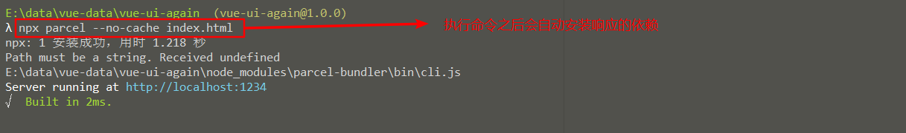
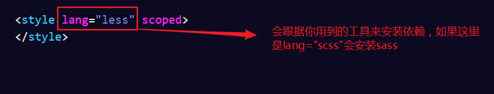
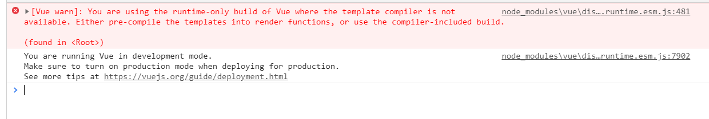
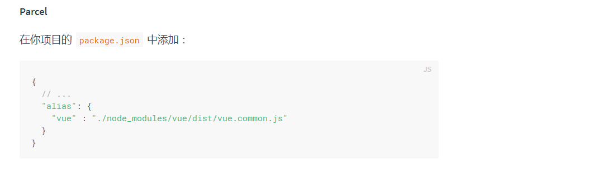

# `button` - 按钮
常用的一些基本操作按钮

## 基础用法
<ClientOnly>
  <easy-button></easy-button>
</ClientOnly>

示例demo:
```html
<g-button icon="setting">按钮</g-button>
<g-button :loading="true">按钮</g-button>
<g-button icon="thumbs-up">按钮</g-button>
<g-button icon="success" icon-position="right">按钮</g-button>

<g-button-group>
  <g-button icon="left">前进</g-button>
  <g-button icon="right" icon-position="right">后退</g-button>
</g-button-group>
```

## API
按钮的属性说明：

属性|说明|类型|默认值  
---|---|---|---  
icon| 设置按钮的图标|string|-  
loading| 设置按钮载入状态|boolean| false
iconPosition|设置按钮图标的位置|string| left

`button-group`组件可以支持将多个按钮进行组合使用

## 知识总结
### `parcel`
> `npx`: 会自动查找当前依赖包中的可执行文件，如果找不到就会帮你**临时**安装
(下次运行时，还需要重新安装)这样，我们的命令就从`./node_modules/.bin/parcel`变为`npx parcel`  
> `--no-cache`:每次打包会生成`dist`目录，有些文件会缓存，会引发奇怪的`bug`。加入这行代码会禁止缓存

先搭建页面的初始结构：
```html
<div id="app">
  <my-demo></my-demo>
  {{msg}}
</div>
<script src="./src/app.js"></script>
```
```js
import Vue from 'vue'
import Demo from './demo' // demo中用到的是less
Vue.component('my-demo',Demo)
new Vue({
  el: '#app',
  data() {
    return {
      msg: 'Hi'
    }
  },
})
```
在项目中安装`parcel`
```
npm i parcel-bundler -D
```
使用`parcel`启动项目
```js
npx parcel index.html --no-cache
```


之后的页面运行效果：

这是由于使用`parcel`时还要进行对应的配置，官方文档有介绍

之后我们的页面就可以正常显示，我们也可以安心撸码了。
### css
#### 1. 用`em`来作为元素大小的计量单位
有时候，我们并不用关心一个元素的宽高，只要它空出一个字的位置就可以。这样可以
比较好的把握距离。  
```css
.g-button {
 /*左右的内边距为1个字的大小*/
 padding: 0 1em;   
}
```
   


