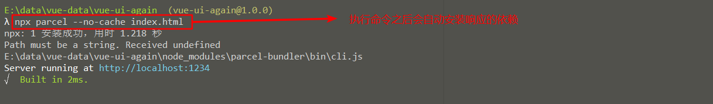
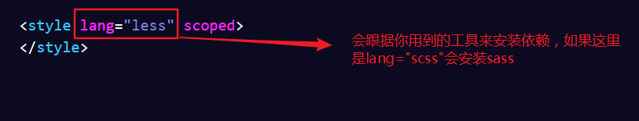
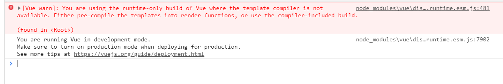
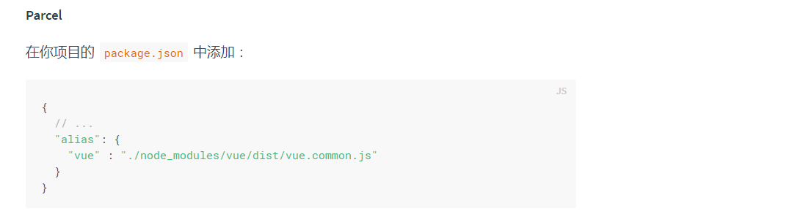
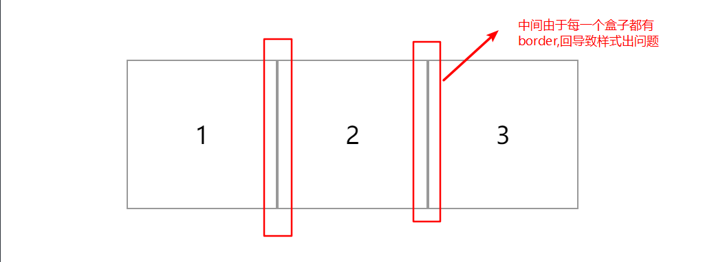
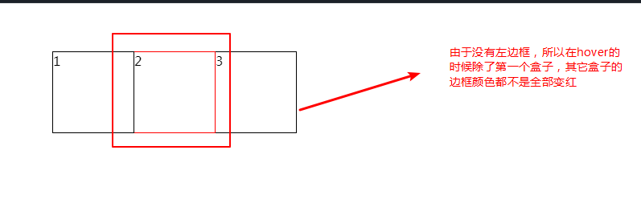
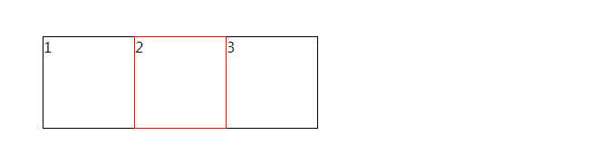

# `button` - 按钮
常用的一些基本操作按钮

## 基础用法
<ClientOnly>
  <easy-button></easy-button>
</ClientOnly>

示例demo:
```html
<g-button icon="setting">按钮</g-button>
<g-button :loading="true">按钮</g-button>
<g-button icon="thumbs-up">按钮</g-button>
<g-button icon="success" icon-position="right">按钮</g-button>

<g-button-group>
  <g-button icon="left">前进</g-button>
  <g-button icon="right" icon-position="right">后退</g-button>
</g-button-group>
```

## API
按钮的属性说明：

属性|说明|类型|默认值  
---|---|---|---  
icon| 设置按钮的图标|string|-  
loading| 设置按钮载入状态|boolean| false
iconPosition|设置按钮图标的位置|string| left

`button-group`组件可以支持将多个按钮进行组合使用

## 知识总结
### `parcel`
> `npx`: 会自动查找当前依赖包中的可执行文件，如果找不到就会帮你**临时**安装
(下次运行时，还需要重新安装)这样，我们的命令就从`./node_modules/.bin/parcel`变为`npx parcel`  
> `--no-cache`:每次打包会生成`dist`目录，有些文件会缓存到`cache`目录中，会引发奇怪的`bug`。加入这行代码会禁止缓存

先搭建页面的初始结构：
```html
<div id="app">
  <my-demo></my-demo>
  {{msg}}
</div>
<script src="./src/app.vue"></script>
```
```js
import Vue from 'vue'
import Demo from './demo' // demo中用到的是less
Vue.component('my-demo',Demo)
new Vue({
  el: '#app',
  data() {
    return {
      msg: 'Hi'
    }
  },
})
```
在项目中安装`parcel`
```
npm i parcel-bundler -D
```
使用`parcel`启动项目
```
npx parcel index.html --no-cache
```


之后的页面运行效果：

这是由于使用`parcel`时还要进行对应的配置，官方文档有介绍

之后我们的页面就可以正常显示，我们也可以安心撸码了。
### css
#### 1. 用`em`来作为元素大小的计量单位
有时候，我们并不用关心一个元素的宽高，只要它空出一个字的位置就可以。这样可以
比较好的把握距离。  
```css
.g-button {
 /*左右的内边距为1个字的大小*/
 padding: 0 1em;   
}
.g-icon {
  /*icon的宽高都是一个字的大小*/
  width: 1em;
  height: 1em;
}
```

#### 2. 通过`flex`布局的`order`属性来改变元素位置
> `order`: 属性定义项目的排列顺序。数值越小，排列越靠前，默认为0  
> `justify-content`: 属性定义了项目在主轴上的对齐方式，默认为`flex-start`:左对齐

**前提：父元素设置`display:flex`**    
当用户设置`iconPosition="right"`的时候，将字体图标的样式中设置为`order:1`,在`iconPosition`不为
`right`的时候不用设置。因为元素的`order`属性默认为0,
并且`justify-content`默认为`flex-start`左右对齐

实现代码:
```css
/*icon在右边，设置order:1;*/
.icon-right {
  margin-left: 0.3em;
  order: 1;
}
/*icon在左边，order: 0;（默认）*/
.icon-left {
  margin-right: 0.3em;
}
```
这样可以简单的通过`css`来实现按钮图标位置的需求

#### 3. `button-group`的`border`叠加问题
效果展示  
  
这个时候我们可能会想到将除了第一个盒子之外的每一个盒子的左边框设置为0
```css
box:not(:first-child) {
  border-left: 0;
}
```
之后页面变成了这个样子：
 
很显然，当`box`处于`hover`状态的时候左边框还是黑色，并不会变红。

比较好的实现方案：
* 将除了第一个盒子的其它盒子的左边框和前一个盒子的右边框重合
（比如第二个盒子的左边框和第一个盒子的右边框重合，第三个盒子和第二个盒子的右边框重合...），
设置`margin-left: -1px`(border宽度)即可。
* 为`hover`的盒子设置：`position: relative; z-index:1;`（只有定位元素才能设置`z-index`）。这样当前
盒子层级变高之后就会把被其它盒子遮住的边框显示出来。
```css
/*父盒子弹性布局*/
.box-container {
  margin: 60px;
  display: flex;
}
/*每个盒子添加1px的黑色边框*/
.box {
  width: 100px;
  height: 100px;
  border: 1px solid black;
}
/*除了第一个盒子，其它盒子的左边框与前一个盒子的右边框重合*/
.box:not(:first-child) {
  margin-left: -1px;
}
/*提高hover盒子的层级，显示被遮住的边框*/
.box:hover {
  position: relative;
  border-color: red;
  z-index: 1;
}
```
这样我们就可以完美实现了
 


### `Vue`
#### 1. 为元素添加类
```html
<div id="app">
  <div class="emo" :class="iconPosition">demo</div>
  <div class="demo" :class="{iconPosition}">demo</div>
  <div class="demo" :class="{[iconPosition]:true}">demo</div>
  <div class="demo" :class="{[`icon-${iconPosition}`]: true}">demo</div>
</div>
```
```js
new Vue({
  el: "#app",
  data: {
    iconPosition: 'left'
  },
})
```
* 第二种写法：是否为`div`添加`iconPosition`类名(类名固定为`iconPosition`)。
* 第三种写法`iconPosition`是一个变量，达成的效果
和第一种一样。
* 最后一种写法：相当于为`div`添加了`icon-left`类名，这里`icon`为写死的字符串，而`iconPosition`是变量

#### 2. 改变组件中插槽的样式
```html
<div class="g-button-group">
  <slot></slot>
</div>
```
这里为`slot`添加`class`类型是没有效果的，可以为他添加一个父元素，然后通过父元素的`class`
来为`slot`中的内容设置样式
```html
<div class="g-button-group">
  <!--可以通过.slot-content来为slot插槽中的内容设置样式-->
  <div class="slot-content">
    <slot></slot>
  </div>
</div>
```

### 细节注意
1. `iconfont`提供的字体图标的整体前缀更改

2. 在使用之前要进行批量去色

3. 要注意字体图标是否对齐以及大小是否合适