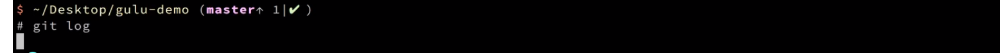
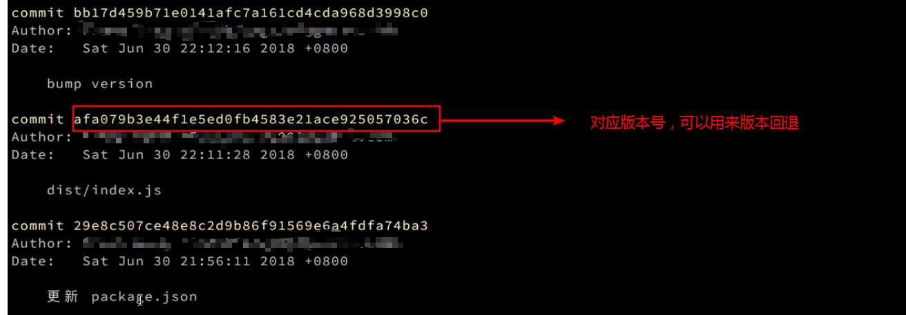
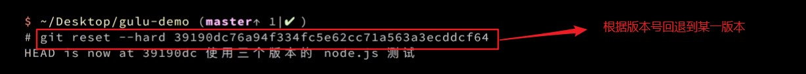
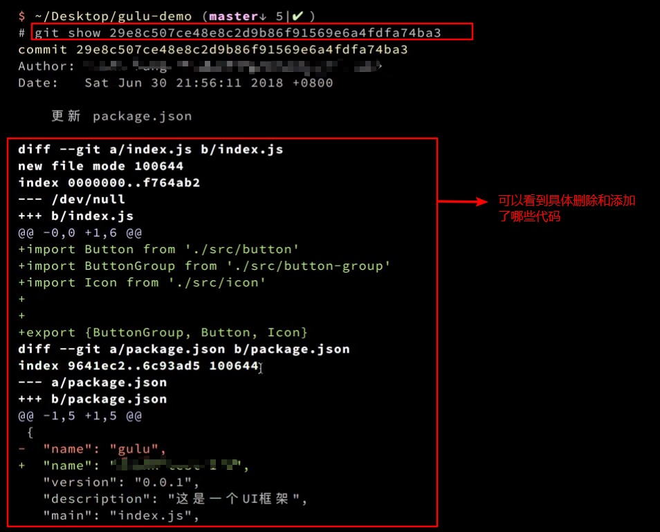
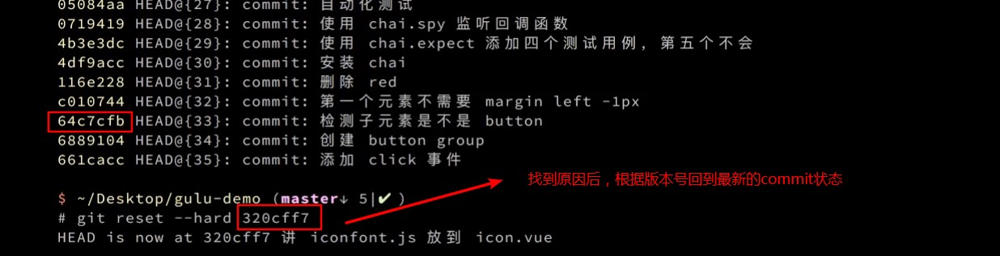
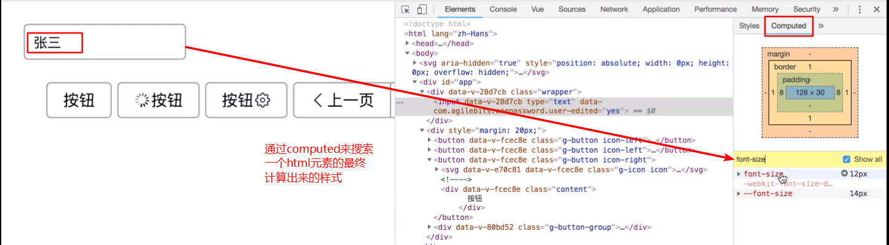

# `input` - 输入框
## 基础用法
<ClientOnly>
  <easy-input></easy-input>
</ClientOnly>

## API
输入框的属性说明：

属性|说明|类型|默认值  
---|---|---|---
value|输入框绑定值|string| _
disabled|是否禁用| boolean| false
readonly|是否只读| boolean| false
type| 表单类型 | string | text
err | 错误提示信息| string | _
placeholder|输入框占位文本|string| 请输入内容

输入框事件说明：
1. 支持`change`事件
2. 支持双向数据绑定(`input`事件)

## 知识总结
### html
#### 添加`disabled`属性
```html
<g-input value="禁用" disabled></g-input>
<g-input value="只读" readonly></g-input>
```
这样写实际上相当于:
```html
<!--错误写法-->
<g-input value="禁用" disabled="true"></g-input>
<g-input value="只读" readonly="true"></g-input>
<!--正确写法-->
<g-input value="禁用" :disabled="true"></g-input>
<g-input value="只读" :readonly="true"></g-input>
```
### Vue
#### 1. 让自己的`input`组件支持双向数据绑定
> 官网教程：
> 1. [在组件上使用`v-model`](https://cn.vuejs.org/v2/guide/components.html#%E5%9C%A8%E7%BB%84%E4%BB%B6%E4%B8%8A%E4%BD%BF%E7%94%A8-v-model)
> 2. [表单输入绑定](https://cn.vuejs.org/v2/guide/forms.html)

`v-model`: 在表单`input`,`textarea`及`select`元素上创建双向数据绑定。

在Vue中`input`的双向数据绑定：
```html
<!--text是定义在data中的数据-->
<input v-model="text">
```
`v-model`实际上是`Vue`为我们提供的一个语法糖，它的实现原理是通过： 
* 将`value`特性动态绑定到变量上
* 通过`input`事件在`value`改变的时候进行重新赋值

所以上面的`html`结构等价于
```html
<!--$event.target.value相当于原生的e.target.value-->
<input 
  :value="text"
  :input="text=$event.target.value"  
>
```
用组件封装一下是这样：
```js
Vue.component('custom-input', {
  props: ['value'],
  template: `
    <div class="wrapper-input" :class="{error}">
      <!--input的value:控件的初始值，此属性是可选的-->
      <input
        :value="value"
        @input="$emit('input',$event.target.value)"
      >
      <template v-if="error">
        <global-icon class="input-icon" name="error"></global-icon>
        <span class="error-message">{{error}}</span>
      </template>
    </div>
  `
})
```
```html
<!--使用v-model指令-->
<custom-input v-model="text"></custom-input>
<!--不使用v-model指令-->
<custom-input :value="text" @input="text=$event"></custom-input>
```
从上面可以看出，`v-model`只不过是`:value="text @input="text=$event"`的一个简写，也就是`Vue`
为我们提供的一个简单的语法糖。之后，我们自己的组件就可以支持双向数据绑定了。

**注意**：`v-model`会忽略所有表单元素的`value`,`checked`,`selected`特性的初始值，而
总是**将`Vue`实例的数据作为数据来源**。应该通过`javascript`在组件中的`data`选项中声名
初始值。

### 细节注意
#### 1. `git`版本回退
1. `git log`: 显示commit历史，以及每次commit发生变更的文件
    
    
2. `git reset --hard [commit]`:重置当前分支的HEAD为指定commit,同时重置暂存区和工作区，与指定commit一致
    
   **这个命令非常危险，会把当前磁盘上的所有变更删掉，所以在执行这个操作之前一定要`commit`提交代码，所有代码才能回来**  
   `npm i`:确保依赖安装正确
3. 之后继续在第一个`git log`生成的`commit`日志中赋值版本号重复第二步。**此时执行`git log`是不会有当前版本之后的代码的，所以commit提交代码之后的第一次`git log`很重要，只有依靠这个日志才能随意切换版本号**
4. `git show [commit]`: 显示某次提交的元数据和内容变化
    
5. `git reflog`:显示当前分支的最近几次提交(commit)
    

这样我们就可以随意切换`git`版本，定位问题到底是在哪个版本出的问题，之后查看我们在出问题的版本到底写了哪些代码，然后根据代码定位所出现的问题。

#### 2. `chrome`调试工具中`css`的`computed`功能
有时候在浏览器中，一个元素的某个`css`属性并不能在样式中找到，这个时候我们可以通过浏览器的`computed`功能来对一个`html`元素的最终计算出来的`css`属性进行搜索，
这样就可以很直观的看到一个元素的某个对应属性的对应值的最终大小

