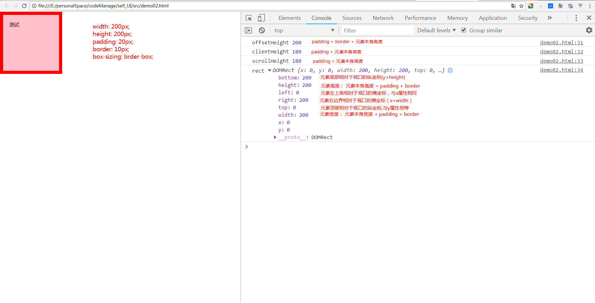
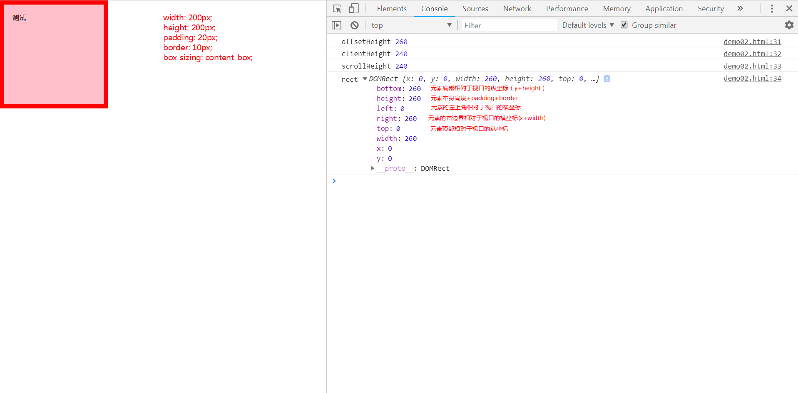

## 项目中准确获取元素的宽高
> 高度计算方法:
> 1. `box-sizing:border-box`: 元素本身高度 = `padding`+`border`+内容高度
> 2. `box-sizing:content-box`: 总高度 = 元素本身高度 + `padding` + `border`（`padding`和`border`会另外占据高度，导致元素最终高度会被`padding`和`border`撑开） 

* `scrollHeight`: `padding` + 元素本身高度 
* `offsetHeight`: `padding`+`border`+ 元素本身的高度
* `clientHeight`: `padding`+ 元素本身高度   
* `getBoundingClientRect.height`: `padding`+`border`+元素本身高度

### Element.getBoundingClientRect()
```js
const box = document.getElementsByClassName('box')[0]
box.getBoundingClientRect()
```
```css
* {
  margin: 0;
  padding: 0;
  box-sizing: border-box;
  /*box-sizing: content-box;*/
}

.box {
  width: 200px;
  height: 200px;
  background-color: pink;
  padding: 20px;
  border: 10px solid red;
}
```
下面是通过设置`box-sizing:border-box;`得到的结果  
  

下面是通过设置`box-sizing:content-box;`得到的结果


### 总结
我们大多数情况下回设置`box-sizing: border-box;`来进行页面布局，防止内容因为`padding`和`border`出现变形
，所以准确获取元素的高度的方法为：
```js
const {height} = box.getBoundingClientRect();
const height = box.offsetHeight;
```

当设置`box-sizing: content-box;`来进行页面布局，准确获取元素的高度的方法为：  
```js
// 内容会被padding和border撑开，获得的值会比实际得到的值要大
const height = box.getBoundingClientRect().height
const height = box.offsetHeight
```
## 项目中获取元素在页面中的位置
> Element.offsetParent:返回最靠近当前元素的、并且`CSS`的`position`属性不等于`static`的上层元素
* offsetLeft/offsetTop:返回当前元素左上角相对于`Element.offsetParent`节点的水平/垂直位移
* Element.getBoundingClientRect().left/top: 元素左上角相对于视口的横/纵坐标

当没有已定位父元素，即当前元素没有`offsetParent`的时候可以通过`offsetLeft`和`offsetTop`来获取到元素在整个页面的位置。
但是这里有一个硬性条件，需要元素没有已定位的父元素
```js
// 方法一：
const box = document.getElementsByClassName('box')[0];
const left = box.offsetLeft;
const top = box.offsetTop;

// 方法二：
const box = document.getElementsByClassName('box')[0];
// 这里使用top替代y的话会导致和window.top冲突 
const {x,y} = box.getBoundingClientRect();
const left = x + window.scrollX;
// const top = y + window.scrollY;
const top = y + document.documentElement.scrollTop;
```

这里的方法二没有前置条件约束，所以不管有没有已定位父元素，都可以用来获取元素在页面中的位置（坐标）。正常使用的话推荐方法二的写法，
不会担心因为有没有被已经定位的父元素影响